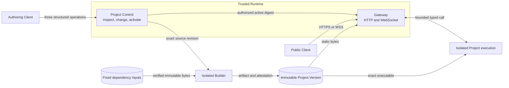
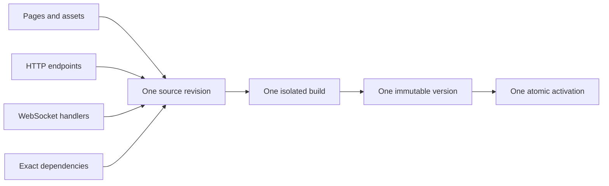

# Shimpz Runtime — Simple v1 Design

| Field | Value |
|---|---|
| Status | Alternative proposal — discussion only |
| Authority | [`SPEC.md`](SPEC.md) Draft 0.2 remains the functional specification |
| Availability | Nothing described here is implemented or available |
| Implementation | Not authorized |
| Owner | Juliano |
| Updated | 2026-08-23 |

This document tests the smallest understandable Runtime design. It does not amend the SPEC. Principal known
disagreements with Draft 0.2 are recorded in [`DRAFT-DECISIONS.md`](DRAFT-DECISIONS.md). If this design is accepted,
the SPEC must be rewritten as one coherent successor Draft rather than leaving two competing contracts.

## 1. The whole idea

The authoring model has only three visible concepts:

| Concept | Meaning |
|---|---|
| Project | The complete site or application and the only build and activation unit |
| Member | One page, asset, HTTP endpoint, or WebSocket handler inside a Project |
| Change | One atomic request to replace Project members and activate the resulting Project version |

Catalog entries, source revisions, builds, artifacts, and active-version pointers are internal Runtime data. They
are not products, services, or concepts the authoring client must manage.

## 2. One Runtime, three isolated responsibilities



Gateway and Project Control form one Runtime product surface, but remain separate authorities. Public traffic
cannot reach Project Control or activate a version; its private endpoint accepts only an admitted external binding.
Project Control cannot issue the external authorization it checks. Project-authored code never runs in either
responsibility. The Builder and each Project execution boundary are physically isolated from the trusted Runtime
and from every other Project.

An implementation may replicate these responsibilities without creating a second activation writer or widening
their authority.

## 3. One Project, one version



A member has no independent build, port, process, version, or publication. Changing one member rebuilds
only its Project. The blast radius is one Project.

Frontend pages are prerendered with Svelte and Tailwind. Node.js exists only inside the isolated build. Request
execution is static delivery plus Rust endpoints and WebSocket handlers. The result is one content-addressed
artifact with its route manifest, exact dependency locks, and provenance.

Exact Node.js, Rust, Svelte, Tailwind, SDK, and builder artifacts remain admission decisions; naming a version here
would not establish provenance.

## 4. Authoring is three operations

```text
project.inspect
project.change
change.status
```

These are illustrative semantic names, not an admitted wire protocol.

`project.inspect` describes the Project and performs bounded, cursor-based search for text, images, routes, and
members. `project.change` submits one external-scope idempotency key, one expected Project revision, and bounded
member changes. Change and build concurrency and rate are bounded per external ownership scope.

`change.status` returns the current internal phase (`accepted`, `validating`, `building`, `authorizing`, or
`activating`) or one terminal result:

```text
active | rejected | failed | conflicted
```

Validation, build, authorization, and activation are internal phases, not separate authoring tools or product
states. `rejected` means validation, policy, or external authorization refused the Change. `failed` means admitted
work could not build, start, or pass health validation. `conflicted` means the expected Project revision changed.
After a terminal result, a retry is a new Change against the current Project revision and idempotency key.

No authoring client, including a future Brain binding, receives filesystem paths, shell, Cargo, Node.js,
dependency-source, builder, host, port, credential, active-digest, or infrastructure controls.

## 5. Six security invariants

1. **No authored code in the trusted Runtime.** Gateway serves only attested immutable bytes or makes a bounded call
   to isolated Project execution. It validates the bounded result and refuses credentials, internal addresses,
   filesystem or stack details, arbitrary headers, and undeclared effects. A route manifest cannot grant authority
   or select an inactive digest.
2. **Public means anonymous and origin-isolated.** Project code receives no Shimpz credential, cookie, internal
   header, or trusted identity. A Project cannot set cookies or weaken Runtime-owned browser policy. The build
   preserves default escaping, permits raw HTML only through a fixed sanitizer, and rejects inline executable
   script; Gateway supplies the restrictive CSP. Project origins must be isolated from Shimpz control surfaces and
   sibling Projects before serving begins.
3. **Builds are offline, secretless, ephemeral, and single-Project.** Only fixed content-addressed inputs enter.
   Their digest is verified before every use or mount. No production data, registry credential, requester,
   approver, or another Project enters the build.
4. **Execution is one exact digest in one bounded sandbox.** It has its own identity and measured CPU, memory,
   ephemeral storage, PID, concurrency, input, output, and time limits, with swap disabled where applicable. v1
   supplies no network, database, durable storage, secrets, background work, or Project-to-Project calls.
5. **Activation is exact and externally authorized.** Source, manifest, locks, toolchains, tests, artifact,
   attestation, candidate start, health result, and external authorization identify the same digest. Activation is
   monotonic compare-and-swap. Every admitted HTTP request and WebSocket connection remains pinned to its selected
   digest until it finishes. Project Control cannot authorize itself, and callers cannot choose a digest.
6. **Ambiguity fails closed.** Out-of-scope and absent Projects are indistinguishable. Malformed, stale, oversized,
   unattested, or unauthorized input is refused. Audit stores bounded metadata and digests, never source, payloads,
   prompts, raw headers, credentials, or secrets.

WebSocket frames are serialized per connection with bounded backpressure. Activation closes connections pinned to
the old digest; clients reconnect to the active version. Runtime WebSocket traffic is separate from
`shimpz.chat.v4`.

## 6. Deliberately small v1

| Included | Deferred |
|---|---|
| Prerendered static pages and assets | Runtime SSR or Node.js request serving |
| Public Rust HTTP endpoints | End-user authentication, cookies, and sessions |
| Request/response WebSocket handlers | Fan-out, background delivery, and connection backplanes |
| Fixed offline dependency inputs | Author-requested packages and external registries |
| Exact per-Project locks and artifacts | Database, storage, secrets, and outbound network |
| Isolated build and execution | Events, queues, jobs, cron, chains, and human input |
| Whole-Project activation | Rollback, Project calls, or per-member deployment |
| Bounded metadata-only audit | Project retention and residue-complete deletion |
| One isolated assigned origin | Custom domains |
| One trusted Runtime product surface | Public multi-role or horizontal-scale design |

These deferrals are security boundaries, not missing configuration. Adding one reopens its identity, authority,
network, data, lifecycle, failure, deletion, and audit decisions.

The unresolved ontology, admission, source custody, retention, deletion, execution substrate, public-origin
authority, toolchain provenance, and dependency governance choices remain in
[`DRAFT-DECISIONS.md`](DRAFT-DECISIONS.md).

No implementation, repository mount, dependency selection, public origin, cross-domain contract, or conformance
claim is authorized by this document.
