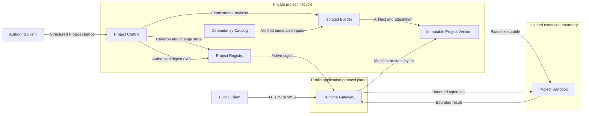
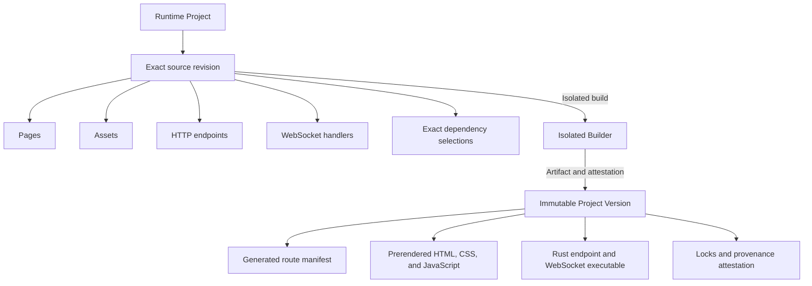
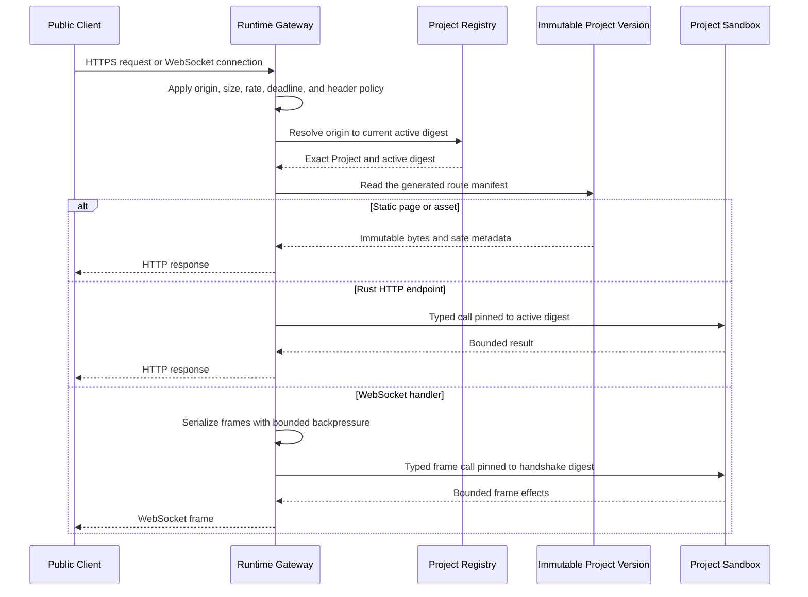
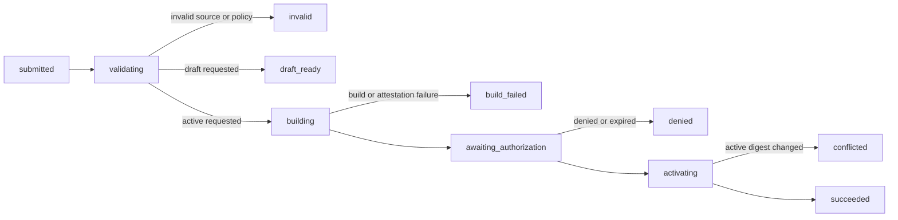

# Shimpz Runtime Reduced v1 Visual Proposal

| Field | Value |
|---|---|
| Status | Alternative reduced-v1 proposal — discussion only |
| Relationship | `SPEC.md` Draft 0.2 remains the functional specification in this repository |
| Availability | The described system does not exist and nothing in this document is implemented or available |
| Implementation | Not authorized |
| Owner | Juliano |
| Updated | 2026-08-23 |

This document is an informative visual proposal for reducing the first Shimpz Runtime contract. It does not amend,
supersede, or interpret [`SPEC.md`](SPEC.md). Where the documents disagree, `SPEC.md` Draft 0.2 governs until the
owner explicitly promotes a successor Draft. The disagreements are listed below so that the alternative can be
reviewed without silently changing the existing specification.

All diagrams are illustrative views. The component legend is a local reading aid, not a second vocabulary or
architecture authority. Operational components in the topology and request-path diagrams use the legend verbatim.
`Runtime Project` keeps the meaning defined by `SPEC.md`; other diagram labels describe only the local view.

## 1. Divergences from SPEC Draft 0.2

| Concern | SPEC Draft 0.2 | This alternative | Reason to evaluate the alternative |
|---|---|---|---|
| Frontend | Static Svelte and Tailwind sites use a separate lane; Runtime pages are dynamic and server-rendered | One Project version contains prerendered frontend assets and Rust endpoint code; Runtime performs no page rendering | Activate the browser assets and the backend contract together while keeping Node.js out of request execution |
| Browser response safety | Runtime rendering escapes content, gates sanitized raw HTML, emits a restrictive CSP, and rejects inline executable script | The isolated frontend build validates equivalent artifact constraints and the Gateway applies non-weakenable Runtime response policy | Moving rendering out of the Runtime must not silently remove the existing browser-security intent |
| Dependency ecosystems | Dependency admission and risk classification are Rust- and Cargo-specific; frontend dependencies remain in another lane | One catalog mechanism contains a fixed offline Rust set and a fixed offline frontend set for reduced v1 | Compiling both outputs into one Project version adds a second supply-chain ecosystem that requires explicit admission evidence |
| Initial surface | The target contract includes HTTP, realtime, events, pages, project calls, chains, human input, database, storage, secrets, and outbound HTTP | Reduced v1 contains static HTTP, Rust HTTP endpoints, and request/response WebSocket handlers only | Keep the first security and lifecycle model small enough to verify |
| Authoring surface | Source, validation, build, publication, rollback, dependencies, invocation, and human response are separate control methods | An authoring client sees four conceptual capabilities and never controls build or activation mechanics | Keep engineering and infrastructure outside the authoring context |
| Project change lifecycle | Revision and version records have separate state machines, build cancellation exists, and Proposal names unadmitted source and metadata | A proposed Project change has one smaller lifecycle; cancellation is excluded and every retry creates a new change against the current revision | Make one atomic authoring request observable without exposing lifecycle mechanics as separate authoring tools |
| Activation authority | Publication activates a validated exact artifact through the Runtime control method | Activation additionally requires exact external authorization evidence that Project Control cannot issue for itself | Keep activation mechanics separate from the authority that permits an externally visible change |
| Activation | Existing WebSocket connections survive publication and each frame resolves the current version | Activation closes connections pinned to the previous version and the generated client reloads and reconnects | Avoid executing frames across incompatible Project versions in the first release |
| Serving roles | One binary may expose multiple serving roles | One public Gateway role fronts isolated Project execution; no public role decomposition is proposed for v1 | Preserve one application traffic plane while keeping untrusted code outside the public process |

This alternative does not select the first implementation vertical. The ontology, admission, execution substrate,
profile order, and toolchain provenance decisions in [`DRAFT-DECISIONS.md`](DRAFT-DECISIONS.md) remain open.

## 2. Design question

Can one small public application plane serve static frontend pages, Rust HTTP endpoints, and WebSocket connections
while every Project is built and executed independently with a bounded blast radius?

The proposed answer is:

```text
one public listener and application protocol plane
+ one private project lifecycle boundary
+ one isolated build boundary
+ one isolated execution boundary per Project
```

"One plane" does not mean one process. Project-authored Rust never enters the Gateway process. The builder never
receives serving credentials or production data. A Project Sandbox never receives another Project's source,
filesystem, identity, limits, or bindings.

## 3. Component legend

| Component | Responsibility |
|---|---|
| Public Client | Sends untrusted HTTP requests and WebSocket frames |
| Authoring Client | Describes a desired Project change through bounded conceptual capabilities |
| Runtime Gateway | Owns the public listener, origin resolution, admission limits, non-weakenable response policy, immutable static delivery, and WebSocket connections |
| Project Control | Owns change validation, revision state, build orchestration, exact-digest authorization handoff, and activation mechanics |
| Project Registry | Stores Project revisions, change states, immutable version references, and the single active-digest pointer |
| Dependency Catalog | Provides bounded public metadata and admitted immutable Rust and frontend build inputs |
| Isolated Builder | Validates source and frontend safety constraints and produces one exact Project version from exact catalog inputs |
| Immutable Project Version | Contains the route manifest, prerendered assets, Rust executable, exact locks, and provenance attestation |
| Project Sandbox | Executes one exact Project version with its own identity and resource envelope |

## 4. Smallest topology



The Gateway is the only public application plane. Project Control is a private lifecycle responsibility, not a
second way to serve a Project. The diagram does not define how another domain authenticates an Authoring Client or
authorizes an exact digest; those contracts belong to their natural producers.

An implementation may replicate the Gateway and Project Sandboxes. Replication does not change the component
model, widen an authority, or permit two writers to activate one Project concurrently.

## 5. Runtime Project anatomy

A Runtime Project is the only source, build, version, activation, and rollback unit. A member can be found and
changed independently, but it never has an independent artifact or deployment.



Svelte and Tailwind are proposed build-time tools only. Their exact versions and toolchain artifacts are not
selected by this document. Umbrella repository governance requires Node.js 24 for any frontend build workload, but
its exact artifact and provenance remain open; Node.js is absent from request execution. Rust 1.98.0 remains a
proposed backend and Runtime baseline until its exact toolchain artifact and provenance are admitted.

The frontend build must preserve default escaping, admit raw HTML only through a fixed sanitized representation,
reject inline executable script, require media dimensions where known, and bind a restrictive response policy into
the attested output. Runtime policy, not Project-authored metadata, supplies the CSP and other browser-safety headers
applied by the Gateway. The exact header set remains a functional-contract decision rather than an authoring choice.

Changing one page, asset, endpoint, or WebSocket handler creates a new source revision and rebuilds only the owning
Project. Successful activation atomically moves the Project's active digest. Rollback atomically makes one exact
retained version active; a public caller cannot select an inactive version.

## 6. HTTP and WebSocket request path



The Gateway uses a generated declarative manifest to distinguish immutable delivery from execution. The manifest
cannot add authority, select an inactive digest, or run authored code in the Gateway.

Each admitted HTTP request pins the active digest until that request finishes. Generated frontend assets use
digest-addressed URLs. Generated frontend calls carry a version marker used only to detect skew; it cannot select a
retained executable. A mismatch fails as `project_version_changed` and instructs the generated client to reload.
Pinned dynamic responses are not cacheable in reduced v1.

WebSocket connections pin the active digest at handshake. Frames are serialized per connection. A bounded queue
overflow closes the connection instead of dropping frames. Activation or rollback closes connections using the
previous digest with a defined `version_changed` close result; the generated client reloads and reconnects. Reduced
v1 therefore does not promise uninterrupted WebSockets across activation.

## 7. Dependencies, build, and activation

"Global dependencies" means one globally discoverable catalog, not globally shared mutable installations. Public
catalog discovery is limited to admitted package names, exact versions, features, availability, and bounded risk;
it never exposes requester, approver, ownership scope, free-text reason, or unresolved package metadata.



Every terminal failure belongs to that proposed Project change. Retrying creates a new proposed change against the
current Project revision; a failed record is never silently reopened or mutated. `draft_ready` is also terminal for
that change. Activating the saved revision requires a new proposed change with `active` intent and the current
expected Project revision.

If the expected active revision changes during activation, the proposed change ends in `conflicted` and the control
result reports the `state_conflict` error.

One catalog admission mechanism supplies two fixed offline ecosystems of immutable data:

- Rust crates, features, SDK, and toolchain inputs;
- Svelte, Tailwind, and frontend toolchain inputs.

Reduced v1 does not admit author-requested packages. The catalog admission authority, evidence requirements,
vulnerability response, and revocation process remain open.
The Isolated Builder consumes only already admitted content-addressed inputs. Each Project receives exact independent
locks and an independent artifact. Build caches may deduplicate content-addressed bytes only after verification and
must verify the digest again before each mount. `node_modules`, Cargo targets, temporary files, processes, memory,
credentials, and mutable state are never shared between Project builds.

A catalog update affects new builds only. It never silently rebuilds or activates every existing Project. A future
vulnerability policy must name the notification, blocking, rebuild, and revocation owner before this model can be
implemented.

Activation requires all of the following to refer to one exact digest:

1. canonical source revision;
2. generated route manifest;
3. frontend and Rust lock digests;
4. SDK and toolchain digests;
5. deterministic validation and test results;
6. artifact digest and builder attestation;
7. authorization evidence supplied by an admitted external binding;
8. monotonic compare-and-swap from the expected active Project revision.

Project Control performs activation mechanics but cannot manufacture the external authorization evidence it
checks. Concurrent or stale activation fails closed as `state_conflict`.

## 8. Authoring view

The reduced authoring surface has four conceptual capabilities:

```text
describe a project
search within a project
propose a project change
describe a proposed change
```

These names are illustrative labels, not a wire protocol. Their transport, request schema, authentication, external
authorization, and error envelope are not defined here.

Description and search are restricted to the ownership scope derived from an admitted external
binding. Absence and out-of-scope access produce indistinguishable results. Search is bounded and cursor-based so an
authoring client can locate text, assets, routes, and members without receiving the complete Project tree.

A proposed Project change accepts an expected Project revision, a bounded set of member changes, and the intent
`draft` or `active`. The intent is not activation authority. The Runtime chooses internal paths, generates locks and manifests,
validates, builds, obtains the required external authorization evidence, and activates when permitted. Project-change
and build concurrency and rate are bounded per external ownership scope.

The Authoring Client never chooses a filesystem path, edits a lockfile, invokes Cargo or Node.js, opens a shell,
selects a builder, selects an execution host, assigns a public origin, activates a digest, or rolls back a Project.

## 9. Intended security crossings

The rows below state constraints for a system that does not exist. They are not descriptions of, or assurances
about, a running system.

| Boundary | What may cross | What must not cross | Intended enforcement and fail-closed result |
|---|---|---|---|
| Public Client → Runtime Gateway | Bounded anonymous HTTP request or WebSocket frame | Shimpz control cookies, machine bearers, internal routing headers, caller-selected digest, or trusted identity fields | Gateway terminates TLS, resolves an exact origin, strips internal and hop-by-hop headers, applies limits, and rejects ambiguous routing |
| Runtime Gateway → Public Client | Immutable static bytes or a validated bounded dynamic response plus Runtime-owned safety headers | Project-weakened CSP, any Project-set cookie, inline executable script, unsafe raw HTML, internal headers, or unbounded response metadata | Gateway applies non-weakenable CSP and browser-safety policy; malformed or unattested output is refused rather than served |
| Runtime Gateway → Immutable Project Version | Active digest and validated path | Mutable route configuration or executable authored code | Gateway reads only the validated manifest and immutable bytes for the active Project version |
| Runtime Gateway → Project Sandbox | Runtime-derived Project, active digest, route identifier, anonymous principal, bounded payload, and deadline | Shimpz control-plane or internal machine credentials; arbitrary headers; raw secrets | Typed framing and exact-digest admission reject missing, stale, malformed, oversized, or unauthorized calls |
| Authoring Client → Project Control | Bounded conceptual Project change | Filesystem path, command, package source, build host, active digest assignment, infrastructure handle, or peer-domain authority claim | Structured validation, ownership scoping, idempotency, revision comparison, quota, and existence hiding fail closed |
| Dependency Catalog → Isolated Builder | Content-addressed archives, exact features, bounded package metadata, and toolchain inputs | Requester, approver, ownership-scope, free-text reason, mutable package tree, registry credential, or unresolved source | Builder verifies every digest before use; missing, changed, revoked, or unadmitted input fails the proposed change |
| Project Control → Isolated Builder | Exact source revision, exact catalog input digests, frontend safety policy, limits, and expected outputs | Network, ambient credentials, serving secrets, production data, another Project's source, or mutable shared dependency state | Ephemeral isolated build validates browser-safety constraints and admits only expected attested outputs; timeout, limit, or provenance mismatch fails the proposed change |
| Project Control → Project Registry | Exact state transition and expected prior revision | Blind overwrite, caller-selected authority, or approximate version fallback | Single-writer monotonic compare-and-swap commits one active digest or returns `state_conflict` |
| Immutable Project Version → Project Sandbox | Exact executable and read-only assets selected by digest | Mutable code, build credentials, another Project version, or unverified input | Sandbox starts only a verified digest and fails unavailable rather than substituting a version |
| Project Sandbox → Runtime Gateway | Bounded typed result or declared WebSocket effect | Raw credentials, stack traces, filesystem paths, internal addresses, unbounded headers, or undeclared effects | Output validation, deadline, size, and effect policy reject the result without widening authority |

Public Project origins must be isolated from Shimpz control surfaces and from sibling Projects so neither control
cookies nor Project cookies can cross those boundaries. Every public request in reduced v1 is anonymous, every Rust
HTTP endpoint and WebSocket handler is publicly reachable through Gateway admission limits, and no Shimpz browser
session or internal machine identity reaches Project code. Project responses cannot set cookies in reduced v1.
Exact public-suffix, serving-domain, and hostname authority remain external open decisions; custom domains are
excluded from reduced v1.

Every Project Sandbox is intended to receive measured CPU, memory, PID, storage, concurrency, input, output, and
wall-time limits with swap disabled where applicable and one effective health check. Network, secrets, database,
durable writable storage, background work, and cross-Project calls are absent from reduced v1 rather than simulated
with permissive placeholders.

Runtime WebSocket traffic is disjoint from `shimpz.chat.v4`. Reduced v1 defines no global fan-out, connection
backplane, background delivery, or cross-Project subscription behavior.

Audit contains bounded identity references, state transitions, safe error codes, resource measurements, and exact
digests. It contains no source, request or response body, WebSocket payload, raw header, prompt, credential, or
secret. Payload logging is disabled by default; any future opt-in logging requires a separately admitted owner,
reader, redaction, retention, and deletion contract.

## 10. Reduced v1 boundary

| Included | Deferred or excluded |
|---|---|
| Runtime Project source revisions | Events and durable queues |
| Static HTTP pages and immutable assets | Chains and human input |
| Rust HTTP endpoints | Project-to-Project calls |
| Request/response WebSocket handlers | Cron, jobs, and background execution |
| One public Gateway plane | Global WebSocket fan-out or a connection backplane |
| Svelte and Tailwind as build-time-only inputs | Runtime SSR or a Node.js serving process |
| Rust Project execution | Database, outbound HTTP, storage, and secrets |
| Global admitted dependency catalog | Arbitrary registries, Git dependencies, and mutable global installations |
| Fixed offline Rust and frontend package sets | Author-requested packages |
| Exact per-Project locks and artifacts | Custom domains |
| Isolated networkless and secretless builds | Multiple public serving roles |
| Atomic whole-Project activation and rollback | Per-page, per-endpoint, or per-handler deployment |
| Bounded metadata-only audit | Request or payload logging by default |

These exclusions are security boundaries. Adding any deferred capability reopens the relevant identity, network,
data, lifecycle, audit, failure, and deletion decisions; it is not a configuration-only change.

## 11. Decision routing

[`DRAFT-DECISIONS.md`](DRAFT-DECISIONS.md) remains the sole open-decision register. This view routes its unresolved
questions rather than creating a parallel identifier set.

| Existing decision | Closure required before implementation |
|---|---|
| P0-1 | Admit or reject Runtime Project in the Shimpz ontology and select its publication, ownership, source-custody, retention, residue-complete deletion, and external authorization path |
| P0-2 | Select the first implementation vertical without treating the complete reduced v1 diagram as one implementation task |
| P0-3 | Select and prove the Project Sandbox substrate and lifecycle, including scale-to-zero versus warm execution |
| P0-4 | Select Hosted-first or Local-first proof and apply that profile's origin threat model |
| P1-3 | Admit exact Rust and frontend toolchain artifacts, builder attestation trust, immutable cache verification, and provenance |
| P1-4 | Admit only the producer-owned cross-domain protocol surfaces needed after the P0 decisions close |
| P1-5 | Assign public hostname namespace authority and isolate control surfaces and sibling Projects |
| P1-6 | Assign Dependency Catalog admission, evidence, vulnerability response, notification, blocking, and revocation authority |

The owner must also decide whether to promote this alternative. Acceptance requires rewriting the affected parts of
`SPEC.md` as one coherent successor Draft rather than maintaining two competing specifications.

No implementation, repository mount, dependency selection, public origin, cross-domain contract, or conformance
claim is authorized by this document.

## 12. Viewing and review

GitHub is the primary viewer. The Mermaid fences may also be pasted into the
[Mermaid Live Editor](https://mermaid.live/) or viewed with a Mermaid-aware Markdown preview. Mermaid syntax stays
within conservative `flowchart` and `sequenceDiagram` constructs because GitHub's active Mermaid version can change.

Rendered review must confirm that every Mermaid fence produces a diagram rather than an error box, labels are
readable in light and dark themes, trust-boundary subgraphs remain visually distinct, and every relative link
resolves. Exported SVG files are presentation outputs only and are not committed as a second source of truth.
